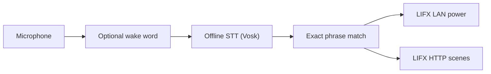

# JDI

> `JDI` is pronounced `jedi` and stands for `Just Do It`.

JDI is a deliberately narrow home voice-control project for LIFX lights.

It is built around a small, practical pipeline:

`microphone -> optional wake word -> offline speech recognition -> exact phrase match -> LIFX action`

The point is not to build a general-purpose assistant. The point is to get a small set of commands working reliably on inexpensive hardware without depending on cloud speech APIs.

This README is organized top-down:

- the top helps you decide which version to use
- the middle gives you the fastest path to a working setup
- the bottom goes into detailed installation, tuning, deployment, and troubleshooting

## Start Here

If you just want the short version:

- use the **Python / Raspberry Pi** path if you want the easiest appliance-style deployment
- use the **Mac** path first if you want to validate the whole idea before buying hardware
- use the **Android** app only if you specifically want a dedicated phone as the device

What already works in this repo:

- Offline speech recognition with [Vosk](https://alphacephei.com/vosk/models)
- Optional local wake-word gating with [openWakeWord](https://github.com/dscripka/openWakeWord) in the Python app
- Local LIFX LAN power control
- LIFX HTTP scene activation for cloud scenes
- Raspberry Pi Python service
- Separate native Android app for a dedicated phone
- Config-driven commands, lights, and groups
- CI/CD for Python and Android

## Quick Start

If you want to move fast, do this in order:

1. test on your Mac
2. prove that LIFX control works
3. prove that your command phrases work
4. buy Pi hardware only after that
5. move to the Pi and add push-to-talk or wake word later

### Fastest First Run

```bash
git clone <your-repo-url> jdi
cd jdi
python3 -m venv .venv
source .venv/bin/activate
python scripts/setup_env.py --with-wakeword
jdi --config configs/mac-test.yaml validate-config
```

Then test:

- `list-lights --transport lan`
- `dispatch "turn all lights off"`
- `run`

The detailed setup flows are below.

## What You Need

### Minimum Technical Requirements

For the Python app:

- Python `3.11+`
- a microphone
- LIFX bulbs on the same network if you want LAN control
- a LIFX token only if you want cloud scenes or HTTP control

For the Android app:

- Android `10+`
- a device you can sideload onto
- permission to keep the app running in the foreground with microphone access

### Recommended Equipment

#### Raspberry Pi Path

Recommended:

- Raspberry Pi 4 or Raspberry Pi 5
- Raspberry Pi OS Lite 64-bit
- a USB microphone

Best practical mic types:

- USB desktop mic
- USB conference mic / speakerphone
- USB mic array

A webcam mic can work for testing, but it is usually worse than a dedicated mic because of distance and room noise.

#### Push-to-Talk Button

For the Pi path, a simple momentary normally-open button is enough:

- one side to `GPIO17`
- one side to `GND`

The Python app already supports this with `gpiozero`.

#### Android Path

Use the Android app only if you want the phone itself to be the appliance:

- built-in mic and speaker
- foreground app running 24/7
- hold-to-talk button on screen

## Which Version Should You Use?

### Raspberry Pi

Use the Python service if you want:

- the simplest always-on appliance
- GPIO push-to-talk
- local Linux deployment with `systemd`
- the least OS friction

This is still the best default for the project.

### Android

Use the Android app if you want:

- a dedicated phone as the hardware
- built-in mic, speaker, battery, and screen
- a single foreground app with one hold-to-talk button

The Android app is intentionally separate from the Python runtime. It is a native Kotlin app under [`android-app`](android-app).

## High-Level Architecture



### Local vs Cloud

- Voice recognition is local.
- Wake-word handling is local.
- LIFX LAN power commands are local.
- LIFX cloud scenes use the LIFX HTTP API and therefore need internet.

## What This Repo Contains

| Path | Purpose |
| --- | --- |
| [`src/jdi_voice`](src/jdi_voice) | Python Raspberry Pi / desktop voice service |
| [`configs/example.yaml`](configs/example.yaml) | Example Python config |
| [`android-app`](android-app) | Separate native Android implementation |
| [`docs/project-plan.md`](docs/project-plan.md) | Original project scope |
| [`docs/architecture.md`](docs/architecture.md) | Python architecture notes |
| [`docs/voice-tuning.md`](docs/voice-tuning.md) | Voice-specific tuning notes |
| [`docs/android-app-plan.md`](docs/android-app-plan.md) | Android architecture and policy decisions |
| [`systemd/jdi.service`](systemd/jdi.service) | Raspberry Pi service unit |
| [`.github/workflows/ci.yml`](.github/workflows/ci.yml) | Branch CI |
| [`.github/workflows/master.yml`](.github/workflows/master.yml) | `master` CI + APK/Docker artifacts |
| [`Dockerfile`](Dockerfile) | Python service container build |

## Basic Setup

```bash
git clone <your-repo-url> jdi
cd jdi
python3 -m venv .venv
source .venv/bin/activate
```

### One-Command Bootstrap

macOS without wake word:

```bash
python scripts/setup_env.py
```

macOS with wake word:

```bash
python scripts/setup_env.py --with-wakeword
```

Raspberry Pi without wake word:

```bash
python scripts/setup_env.py --config configs/home.yaml
```

Raspberry Pi with wake word:

```bash
python scripts/setup_env.py --with-wakeword --config configs/home.yaml
```

That bootstrap command:

- upgrades packaging tools
- installs Python dependencies
- installs the local package in editable mode
- downloads the small Vosk model if needed
- creates the target config from the example if missing
- validates the config
- smoke-tests wake-word startup if enabled

## Detailed Setup Flows

## Mac First

If you are not on the Pi yet, test on your Mac first.

That lets you validate:

- your command list
- your microphone
- your LIFX discovery and control path
- whether wake word is worth the complexity

### Minimal Mac Test Flow

1. Bootstrap:

```bash
python scripts/setup_env.py --with-wakeword
```

2. Validate the config:

```bash
jdi --config configs/mac-test.yaml validate-config
```

3. Test LIFX discovery:

```bash
jdi --config configs/mac-test.yaml list-lights --transport lan
```

4. Test one command without voice:

```bash
jdi --config configs/mac-test.yaml dispatch "turn all lights off"
```

5. Run the live loop:

```bash
jdi --config configs/mac-test.yaml run
```

### Keyboard Push-To-Talk On macOS

For terminal-based push-to-talk testing:

```yaml
push_to_talk:
  enabled: true
  mode: keyboard
  keyboard_key: space
```

Then run:

```bash
jdi --config configs/mac-test.yaml run
```

Behavior:

- keep the terminal focused
- press `space`
- say one command

### Wake Word On macOS

For wake-word testing:

```yaml
wake_word:
  enabled: true
  model_names:
    - hey jarvis
  inference_framework: onnx

push_to_talk:
  enabled: false
```

Then run:

```bash
jdi --config configs/mac-test.yaml run
```

Test order:

1. direct dispatch
2. always-listening
3. keyboard push-to-talk
4. wake word

Do not enable wake word and push-to-talk at the same time in the Python config.

## Raspberry Pi Deployment

### OS Setup

Use Raspberry Pi Imager and install:

- `Raspberry Pi OS Lite (64-bit)`

Recommended Imager options:

- set hostname
- enable SSH
- preconfigure Wi-Fi if needed
- set username and password

### Base Packages

After first boot:

```bash
sudo apt update
sudo apt full-upgrade -y
sudo reboot
```

Then:

```bash
sudo apt update
sudo apt install -y \
  git \
  python3-venv \
  python3-dev \
  portaudio19-dev \
  libatlas-base-dev \
  libopenblas-dev \
  libspeexdsp-dev
```

### Install The App

```bash
cd /home/pi
git clone <your-repo-url> jdi
cd /home/pi/jdi
python3 -m venv .venv
source .venv/bin/activate
python scripts/setup_env.py --config configs/home.yaml
```

If you also want wake word:

```bash
python scripts/setup_env.py --with-wakeword --config configs/home.yaml
```

### Fill Out `configs/home.yaml`

Start from the example:

```bash
cp configs/example.yaml configs/home.yaml
```

Then edit:

- `recognition.model_path`
- `lights.*.label`
- `commands`
- `scenes`
- `wake_word.enabled`
- `push_to_talk.enabled`

### Validate Before Voice Testing

```bash
jdi --config configs/home.yaml validate-config
```

### Verify LIFX Without Speech First

LAN discovery:

```bash
jdi --config configs/home.yaml list-lights --transport lan
```

HTTP scenes:

```bash
export LIFX_TOKEN=replace-me
jdi --config configs/home.yaml list-scenes
```

Direct dispatch:

```bash
jdi --config configs/home.yaml dispatch "turn all lights off"
```

### Run The Voice Loop

```bash
jdi --config configs/home.yaml run
```

Recommended progression:

1. always-listening first
2. push-to-talk second if room noise is a problem
3. wake word last

## Android App

The Android app lives in [`android-app`](android-app). It is a separate implementation for a dedicated phone.

It includes:

- foreground microphone service
- offline Vosk recognition
- optional wake phrase
- one hold-to-talk button in the UI
- LIFX LAN power control
- LIFX HTTP scene activation

### Build The Android App

From the command line:

```bash
cd android-app
./gradlew --no-daemon --console=plain lintDebug testDebugUnitTest assembleDebug assembleRelease
```

Outputs:

- debug APK: `android-app/app/build/outputs/apk/debug/app-debug.apk`
- release APK: `android-app/app/build/outputs/apk/release/app-release-unsigned.apk`

The release APK is unsigned by default. That is fine for local sideloading after you sign it with your own key.

See [`android-app/README.md`](android-app/README.md) for the dedicated Android setup flow.

## Configuration Overview

### Python Config

The Python service uses YAML. The example is in [`configs/example.yaml`](configs/example.yaml).

Core concepts:

- `lights`
- `scenes`
- `commands`
- `wake_word`
- `push_to_talk`
- `lifx`

Power commands map a phrase to:

- a target
- a value like `on`, `off`, or `toggle`
- a transport: `lan` or `http`

### Android Config

The Android app uses JSON stored in app-private storage. The default seed config is in [`android-app/app/src/main/assets/default-config.json`](android-app/app/src/main/assets/default-config.json).

## Scenes

There are two scene models in this repo.

### Local Scenes

- defined in Python YAML
- run over LIFX LAN
- useful if you want fully local behavior

### Cloud Scenes

- backed by LIFX HTTP
- activate existing scenes already stored in your LIFX account
- used by the Android app

If your scenes are already complex and live in LIFX cloud, use HTTP scene activation instead of recreating them by hand.

## Voice Tuning

### Wake-Word Tuning

The practical voice-specific training path is wake-word verification, not full speech-model retraining.

The Python app includes a helper:

```bash
jdi train-wakeword-verifier \
  --model-name hey_jarvis.onnx \
  --positive data/wakeword/positive/*.wav \
  --negative data/wakeword/negative/*.wav \
  --output runtime/hey_jarvis_verifier.pkl
```

Then wire that verifier into your config:

```yaml
wake_word:
  custom_verifier_models:
    hey_jarvis: runtime/hey_jarvis_verifier.pkl
```

### Command Recognition Tuning

The most effective order is:

1. restrict the grammar
2. shorten the phrases
3. improve the microphone
4. reduce room noise
5. only then think about deeper ASR adaptation

For this project, full acoustic-model fine-tuning is usually the wrong place to start.

See [`docs/voice-tuning.md`](docs/voice-tuning.md) for the longer version.

## CI/CD

This repo includes separate workflows for branches and `master`.

### Branch Workflow

[`.github/workflows/ci.yml`](.github/workflows/ci.yml)

Runs:

- Python lint
- Python package build
- Python tests
- Android lint
- Android unit tests
- Android debug APK build

### `master` Workflow

[`.github/workflows/master.yml`](.github/workflows/master.yml)

Runs everything above, plus:

- Android debug and release APK builds
- APK artifact upload
- Python Docker image build
- Docker artifact upload

## Docker

The root [`Dockerfile`](Dockerfile) builds the Python voice service container:

```bash
docker build -t jdi:local .
```

The container is mainly useful for packaging and CI verification. The Raspberry Pi deployment path is still the primary target.

## Troubleshooting

### LAN Discovery Fails

- make sure the controller and bulbs are on the same local network
- start with `list-lights --transport lan`
- verify the configured LIFX labels match the actual labels
- if HTTP works and LAN does not, suspect local network discovery rather than speech recognition

### The Wrong Microphone Is Chosen

- run `jdi list-audio-devices`
- set `audio.device` explicitly

### Wake Word Fires Too Often

- raise the threshold
- increase debounce or patience
- train a verifier model for your voice
- switch to push-to-talk if the room is noisy

### Commands Are Misrecognized

- shorten the phrases
- avoid similar phrases
- move the mic closer
- prefer a dedicated USB mic over a webcam mic

## Suggested First Weekend Plan

1. Get direct `dispatch` working.
2. Confirm LAN or HTTP light control without touching speech.
3. Validate recognition with a very small phrase list.
4. Add push-to-talk if the room is noisy.
5. Add wake word only after the rest is already stable.

That path gets you to a working system faster than trying to debug hardware, speech, wake word, and lighting all at once.
