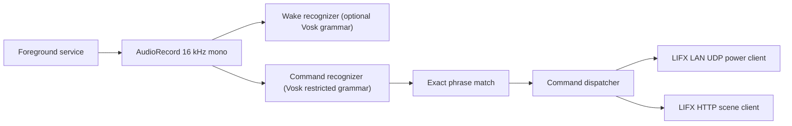

# Android App Plan

## Goal

Build a separate Android app in this repo that provides the same narrow voice-control workflow as the Raspberry Pi project:

- offline phrase recognition
- optional wake phrase
- push-to-talk from a single on-screen button
- LIFX LAN power control where possible
- LIFX HTTP scene activation where needed

The Android app is for a **dedicated phone** that can stay plugged in and run a single foreground app full time.

## Key Decisions

### 1. Native Android app, not Python-on-Android

The existing Python code is the wrong runtime shape for Android. The Android version should be a separate Kotlin app that reuses the same architecture and config ideas, but not the Python process model.

### 2. Vosk for both wake phrase and command recognition

Instead of trying to make `openWakeWord` work on Android, the app uses Vosk for:

- a very small wake phrase grammar, for example `["hey jarvis"]`
- a restricted command grammar built from the configured command phrases

This is simpler, smaller, and more Android-friendly than trying to port the Python wake-word stack directly.

### 3. Foreground service, not background magic

Continuous microphone capture on Android belongs in a foreground service with a persistent notification.

The app will:

- start a foreground service explicitly from the UI
- keep microphone capture in that foreground service
- expose current status back to the activity

The app will **not** try to auto-start microphone capture silently at boot. Android keeps tightening background start rules, especially for microphone-related foreground services, and that is the wrong place to fight the OS.

### 4. Battery optimization handled explicitly

The app will include a one-tap action to request exemption from battery optimization.

That does not guarantee behavior across every Android vendor skin, but it is the normal baseline for a dedicated always-on device.

### 5. Raw LIFX LAN client for the small command subset

The Python repo currently relies on `lifxlan`. Android does not have that exact library shape, and only a small subset is required here.

The Android app will implement only the LAN messages it needs:

- `GetService` / `StateService` for discovery
- `GetLabel` / `StateLabel` for labeling discovered lights
- `LightGetPower` / `LightStatePower` for toggle support
- `LightSetPower` for power commands

No color scene authoring or broad protocol coverage is needed for the Android app.

### 6. HTTP only for cloud scenes

LIFX app scenes remain cloud-backed and will be activated through the LIFX HTTP API.

### 7. JSON config in app-private storage

Instead of YAML, the Android app will use a JSON config stored in app-private files.

Reasons:

- less Android dependency surface
- easier to parse and validate with Kotlin serialization
- easier to edit in a raw text box inside the app

The app will copy a default config into private storage on first launch and allow editing it in a dedicated config screen.

### 8. Model download at first run

Bundling the Vosk model inside the APK would bloat the project and make iteration awkward.

The app will instead:

- download the small Vosk model zip on demand
- unpack it into app-private storage
- reuse it after the first download

After the model is downloaded, recognition remains offline.

## Feature Scope

Included:

- on-screen press-and-hold push-to-talk button
- optional wake phrase running continuously in foreground service
- direct LAN power commands for individual lights, groups, and `all`
- toggle support over LAN
- HTTP scene activation
- config editor screen
- model download and status
- persistent foreground notification
- status text for last transcript and last action

Excluded from this first Android version:

- speaker verification
- TTS confirmations
- visual scene editor
- boot-time automatic microphone startup
- app store distribution work

## Runtime Flow

## Service State Machine

States:

- `Stopped`
- `Idle`
- `ListeningForWake`
- `ListeningForManualCommand`
- `ListeningForPostWakeCommand`
- `Executing`
- `Error`

Rules:

- If wake phrase is enabled, idle mode continuously feeds audio into the wake recognizer.
- If the user presses and holds the button, manual command mode overrides wake listening.
- When wake is detected, the engine discards a short post-wake delay and then starts a fresh command recognizer session.
- For command recognition, only configured phrases are accepted.

## Config Shape

Top-level config sections:

- `audio`
- `wakeWord`
- `lifx`
- `lights`
- `groups`
- `commands`

Command action types:

- `power`
- `scene`

Power action values:

- `on`
- `off`
- `toggle`

Targets:

- light alias
- group alias
- `all`

## Android Policy Notes

The app is designed around the policies most likely to matter on a dedicated phone:

- microphone use is tied to a foreground service
- battery-optimization exemption is requested explicitly
- the app is intended to stay open or be restarted manually after reboot
- the phone should remain on power

## Verification Strategy

Inside this environment, the Android project can be checked structurally, but not fully built, because the local machine does not currently have:

- a JDK
- Gradle
- Android SDK / build tools

So the implementation goal is:

- coherent Android project structure
- careful module separation
- consistent Gradle files
- strong inline documentation
- a dedicated Android README with step-by-step build and sideload instructions
