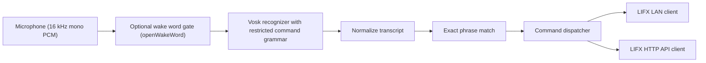

# Architecture

## Data Flow

## Why This Shape

- The command list is intentionally narrow. That makes exact phrase matching viable and much more reliable than a general voice assistant.
- Vosk supports small models that are designed for Raspberry Pi-class hardware and supports runtime vocabulary restriction, which is exactly what this project needs.
- openWakeWord stays optional because it improves convenience but also creates most of the false-activation pain in small home setups.
- LIFX LAN control is the local-first path for per-light power and locally defined scenes.
- LIFX HTTP is still useful because official cloud scenes already exist there.

## Module Layout

- `jdi_voice/config.py`
  - YAML loading and validation.
- `jdi_voice/audio.py`
  - Microphone capture using `sounddevice`.
- `jdi_voice/recognition.py`
  - Vosk recognizer session factory.
- `jdi_voice/wakeword.py`
  - openWakeWord integration.
- `jdi_voice/gpio.py`
  - Optional GPIO push-to-talk button.
- `jdi_voice/phrase_matcher.py`
  - Exact normalized phrase matching.
- `jdi_voice/controller.py`
  - Action dispatch and transport selection.
- `jdi_voice/lifx/lan_client.py`
  - Local LAN control via `lifxlan`.
- `jdi_voice/lifx/http_client.py`
  - Official LIFX HTTP API wrapper.
- `jdi_voice/service.py`
  - Runtime loop and mode switching.

## Modes

### Always Listening

The simplest test mode. Vosk continuously listens for one of the configured phrases.

### Wake Word

The microphone stream feeds openWakeWord. Once a wake word fires, the code opens a fresh Vosk session and listens for one command.

### Push to Talk

The GPIO button gates the recognizer. This is the most reliable home mode if the room is noisy or the microphone placement is poor.

